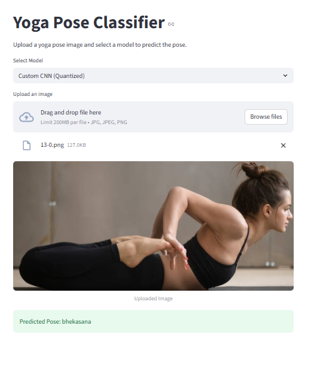

# Yoga Pose Classifier Web App

A simple Streamlit app to classify yoga poses from images using quantized TFLite models.

## How it works
- Upload a yoga pose image and select a model.
- The app resizes the image to 224x224, preprocesses it for the selected model, and runs inference using a quantized TensorFlow Lite model.
- The predicted yoga pose class is displayed.

## Models used
- **CNN Transfer Learning (EfficientNetB0, Quantized):**
  - Uses EfficientNetB0 as a feature extractor with a custom classification head.
  - Trained with transfer learning on the Yoga-107 dataset.
  - Quantized to TFLite for fast inference.
- **Custom CNN (Quantized):**
  - A custom convolutional neural network trained from scratch on the same dataset.
  - Also quantized to TFLite.

## Setup
1. Install dependencies:
   ```bash
   pip install -r requirements.txt
   ```
2. Ensure these files are present:
   - `app.py`
   - `class_labels.json`
   - `models/tl_model_quant.tflite`
   - `models/advanced_model_quant.tflite`

## Run
```bash
streamlit run app.py
```

## Usage
- Open the provided local URL (usually http://localhost:8501)
- Select a model
- Upload a yoga pose image
- See the predicted class

## Demo

Below is a demonstration of the app using a sample image:

<p align="center">
  
</p>
